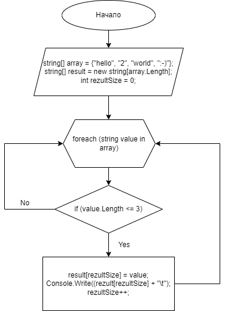

# Итоговая проверочная работа

## Задача:
Написать программу, которая  из имеющегося массива строк формирует массив из строк, длина которых меньше, либо равна 3.

## Описание алгоритма:
* Задаем массив array, в котором перечислены все строки;
* Создаем новый массив result, который будет выводиться в конце, как результат работы программы;
* Вводим переменную resultSize, которая будет использоваться в качестве определения индекса массива result;
* Инициализируем цикл foreach, где переменная value по очереди принимает значение каждого элемента (каждой строки) массива  array;
* Инициализируем цикл if, в котором выясняем, равна ли трем или больше трех каждая строка массива;
* Если условие цика if истинно, то записываем в значение элемента массива result значение value и выводим это значение на экран;
* Увеличиваем значение resultSize на 1;
* Проходим цикл foreach до тех пор, пока не проанализируются все строки массива array.

## Блок-схема алгоритма

